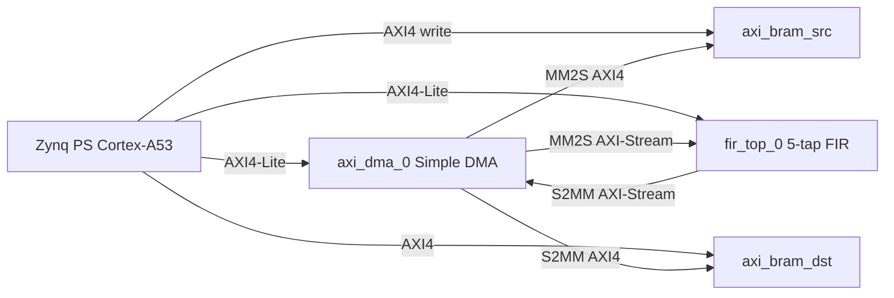
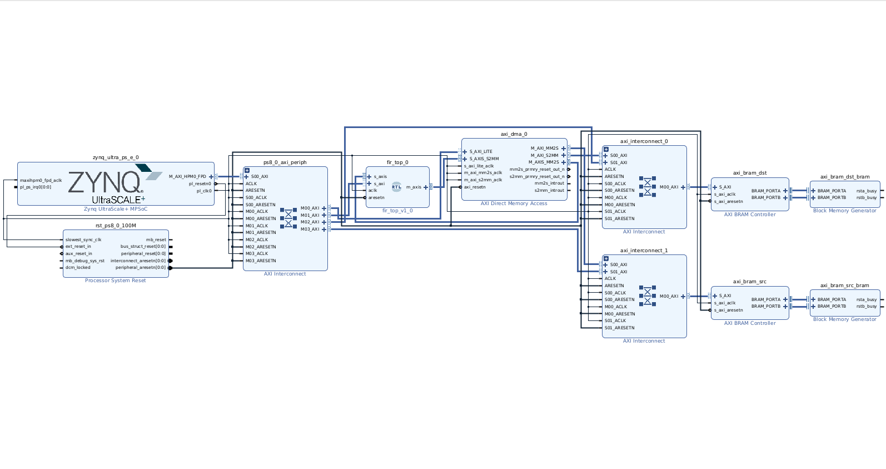
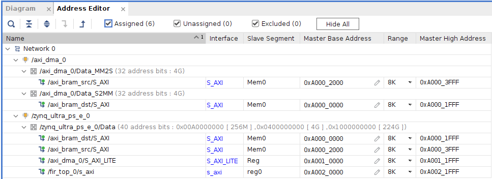

# 01 — Block Design

This lab uses a fixed platform exported as **`hardware/platform/fir_demo_wrapper.xsa`**. You do **not** need to re-run Vivado unless you want to modify the PL design. The reference Tcl script `hardware/scripts/create_bd.tcl` documents the original connectivity.

**Target board:** Avnet Ultra96-V2 (Zynq UltraScale+ `xczu3eg`)

---

## High-level architecture

Two paths exist in parallel:

1. **Control plane (AXI4-Lite / AXI4 GP)** — PS configures DMA and FIR, reads results from destination BRAM.
2. **Datapath (AXI-Stream + AXI4 HP)** — DMA streams samples from source BRAM through the FIR; filtered samples land in destination BRAM.

---

## Block design components

| Instance | IP / module | Purpose |
|----------|-------------|---------|
| `zynq_ultra_ps_e_0` | Zynq UltraScale+ PS | Application CPU, JTAG debug, UART |
| `axi_dma_0` | AXI DMA 7.1 | Simple DMA (scatter-gather **disabled**) |
| `fir_top_0` | Custom RTL (`fir_top`) | 5-tap transposed FIR; AXI4-Lite + AXI-Stream |
| `axi_bram_src` + BRAM | AXI BRAM Ctrl + `blk_mem_gen` | **Source** memory — stimulus (writable from PS) |
| `axi_bram_dst` + BRAM | AXI BRAM Ctrl + `blk_mem_gen` | **Destination** memory — dual-port (PS port A, DMA port B) |

### AXI DMA configuration

- **MM2S** (memory → stream): reads `axi_bram_src`, pushes samples into FIR `S_AXIS`
- **S2MM** (stream → memory): captures FIR `M_AXIS`, writes `axi_bram_dst`
- **32-bit** data width on both memory and stream interfaces
- **Simple mode** — length programmed by software (`XAxiDma_SimpleTransfer`)

### Custom FIR (`fir_top`)

Wrapper around `my_fir_v1_0`:

| Interface | Role |
|-----------|------|
| `s_axi` | Coefficient registers + enable bit |
| `s_axis` | Input samples from DMA MM2S |
| `m_axis` | Filtered output to DMA S2MM |

**Register map (byte offsets from `fir_top_0` base):**

| Offset | Name | Description |
|--------|------|-------------|
| `0x00` | `CTRL` | Bit 0 = enable (`EN`) |
| `0x04` | `COEF_1` | Tap 1 (16-bit signed in low half of word) |
| `0x08` | `COEF_2` | Tap 2 |
| `0x0C` | `COEF_3` | Tap 3 |
| `0x10` | `COEF_4` | Tap 4 |
| `0x14` | `COEF_5` | Tap 5 |

Default demo coefficients: `100, 200, 300, 200, 100`.

### Source BRAM (stimulus)

- True dual-port RAM in the exported XSA (PS can write port A; DMA reads port B).
- **Not** pre-initialized in the shipped bitstream — students load `stimulus/src_stimulus.coe` at runtime via **XSCT** (see [03-execution.md](03-execution.md)).
- 32-bit words; FIR uses the **lower 16 bits** as signed samples.

### Destination BRAM (results)

- True dual-port RAM: PS reads port A after the transfer; DMA writes port B during S2MM.

---

## Address map

| Peripheral | Base | Size |
|------------|------|------|
| `axi_bram_dst` | `0xA0000000` | 8 KB |
| `axi_bram_src` | `0xA0002000` | 8 KB |
| `axi_dma_0` | `0xA0010000` | 4 KB |
| `fir_top_0` | `0xA0020000` | 4 KB |

These addresses appear in `software/src/hw_config.h` and in the BSP `xparameters.h` after platform import.

---

## RTL files (`hardware/rtl/`)

| File | Description |
|------|-------------|
| `fir_top.v` | Top wrapper — instantiates `my_fir_v1_0` |
| `my_fir_v1_0.v` | FIR top — connects S_AXI, S_AXIS, M_AXIS |
| `my_fir_v1_0_S_AXI.sv` | AXI4-Lite register file |
| `my_fir_v1_0_S_AXIS.sv` | Input stream adapter |
| `my_fir_v1_0_M_AXIS.sv` | Output stream adapter |
| `FIR_transposed.sv` | Transposed FIR datapath |
| `transposed_block.v` | FIR MAC building block |

---

## Optional: rebuild hardware in Vivado

1. Create a Vivado project for Ultra96-V2.
2. Add all files under `hardware/rtl/`.
3. Run `source hardware/scripts/create_bd.tcl` (adapt instance names if your flow differs).
4. Assign addresses, generate bitstream, export **XSA** to replace `hardware/platform/fir_demo_wrapper.xsa`.

For the tutorial lab, **importing the provided XSA is sufficient**.

---

**Next:** [02 — Software](02-software.md)
