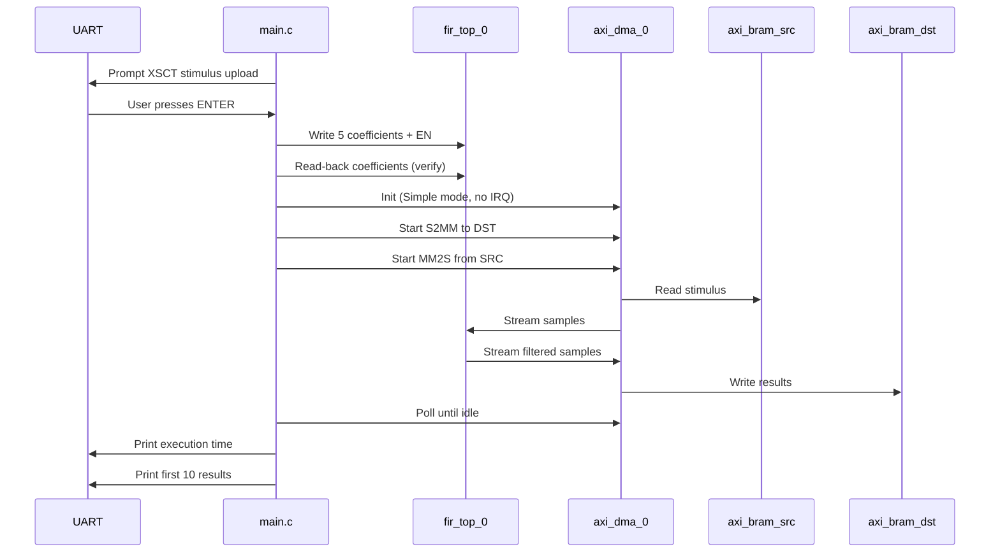
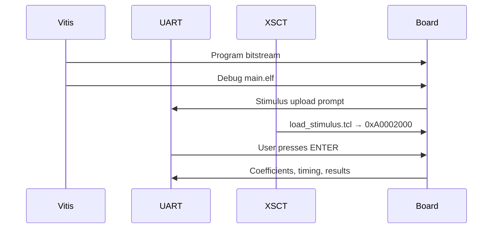

# 02 — Software

Bare-metal application for **Cortex-A53** (no Linux). Sources are in `software/src/`.

---

## Files

| File | Purpose |
|------|---------|
| `main.c` | Main application — FIR setup, DMA transfer, timing, results |
| `hw_config.h` | Peripheral base addresses / transfer length (maps to `xparameters.h`) |

---

## Application flow



---

## Key design choices

### No PS DDR for datapath

Stimulus and results live in **PL BRAM**. The application does **not** call `Xil_DCacheFlushRange` / `Invalidate` — there is no cache coherency issue for this path.

### Stimulus via XSCT (not in C)

`WaitForStimulusUpload()` prints instructions and blocks on UART until **Enter**. Students load `stimulus/src_stimulus.coe` with `load_stimulus.tcl` while the CPU is waiting.

### DMA order: S2MM first, then MM2S

```c
XAxiDma_SimpleTransfer(..., DEST_BRAM, ..., XAXIDMA_DEVICE_TO_DMA);  // S2MM
XAxiDma_SimpleTransfer(..., SRC_BRAM,  ..., XAXIDMA_DMA_TO_DEVICE);  // MM2S
```

S2MM must be armed before the FIR produces output; MM2S feeds the input stream.

### Transfer size

```c
#define TRANSFER_LEN_BYTES  1024U   /* 256 samples × 4 bytes/word */
```

Matches `stimulus/src_stimulus.coe` (256 words, values `0x1` … `0x100`).

### Accelerator timing

Uses the ARM global timer (`XTime_GetTime` / `xtime_l.h`):

- **Execution time** = from DMA kickoff until **both** MM2S and S2MM complete
- Also prints per-channel done times and sample throughput

---

## `hw_config.h` and BSP

After importing the XSA, Vitis generates `xparameters.h` with names such as:

- `XPAR_AXI_DMA_0_DEVICE_ID`
- `XPAR_AXI_BRAM_SRC_BASEADDR` or `XPAR_BRAM_1_BASEADDR`
- `XPAR_AXI_BRAM_DST_BASEADDR` or `XPAR_BRAM_0_BASEADDR`
- `XPAR_FIR_TOP_0_BASEADDR`

`hw_config.h` selects the correct macro when present, with fallbacks matching the XSA.

---

## Create the Vitis project

1. **File → New → Platform Project** (or update existing).
2. **Hardware specification:** `hardware/platform/fir_demo_wrapper.xsa`
3. Build the platform (FSBL / PMU optional for this lab).
4. **File → New → Application Project**
   - Platform: your `fir_demo` platform
   - Domain: `psu_cortexa53_0`
   - Template: **Empty Application** (or Hello World — then replace sources)
5. Copy `software/src/main.c` and `software/src/hw_config.h` into the app `src/` folder (replace the template main file if present).
6. **BSP settings** — ensure **axi_dma** driver is included (usually auto from XSA).
7. Build → `fir_demo.elf` (name may vary).

### Minimal link requirements

The app uses BSP drivers:

- `xaxidma` — DMA
- `xilprintf` / UART — console
- `xtime_l` — timer (standalone)

---

## Expected UART output (excerpt)

```
FIR DMA demo start
  FIR base 0xA0020000
  DMA dev id 0, len 1024 bytes

=== Stimulus upload required (XSCT) ===
...
Press ENTER in this UART window when upload is complete...
src BRAM[0] = 0x00000001
Starting FIR DMA demo...

FIR ctrl = 0x00000001 (EN=1)
coef[0] wrote 100, read 100
...
Accelerator timing (256 samples, 1024 bytes):
  MM2S done: ...
  S2MM done: ...
  Execution: ... us
result[0] = ...
FIR DMA demo done
```

---

## Launch on board (main + XSCT)

This section replaces the old execution doc. You run **`main.c`** from Vitis and load stimulus with **XSCT** while the app waits on UART.

### Prerequisites

- [ ] Platform built from `hardware/platform/fir_demo_wrapper.xsa`
- [ ] Application built from `software/src/main.c` + `hw_config.h`
- [ ] Ultra96-V2 connected (JTAG + UART)
- [ ] `stimulus/src_stimulus.coe` and `stimulus/load_stimulus.tcl` available on the lab PC

### Board setup (Ultra96-V2)

| Setting | Value |
|---------|--------|
| **SW3** (boot mode) | SW3.1 **ON**, SW3.2 **OFF** → JTAG debug |
| **microSD** | Remove card (avoids Linux boot during debug) |
| **Power** | Power-cycle after changing switches |

### Step 1 — Program the FPGA

In Vitis:

1. **Xilinx → Program Device** (or use your debug configuration).
2. Select the bitstream from the platform build.
3. Click **Program**.

### Step 2 — Launch `main.c` (System Debugger)

1. **Run → Debug Configurations** → **Single Application Debug** (or System Debugger).
2. Select your application ELF (e.g. `fir_demo.elf`).
3. Open the **UART serial terminal** (115200 8N1, Avnet USB-UART port).
4. Click **Debug** / **Run**.

The app prints the banner, then stops at:

```
=== Stimulus upload required (XSCT) ===
...
Press ENTER in this UART window when upload is complete...
```

**Leave it waiting** — do not press Enter yet.

### Step 3 — Load stimulus with XSCT

In **xsct**:

```tcl
source <repo>/stimulus/load_stimulus.tcl
```

That is all — the script picks up `src_stimulus.coe` from the same folder and writes to `0xA0002000`.

> **Tip — `mwr` / `mrd` in XSCT**  
> The load script uses these under the hood. Handy for spot checks:
> ```tcl
> mrd 0xA0002000 4          ;# read 4 words from src BRAM
> mwr 0xA0002000 0x00000001 ;# write one 32-bit word (hex)
> mrd 0xA0000000 4          ;# peek at dest BRAM after the demo
> ```

### Step 4 — Continue from UART

1. Return to the **UART terminal** (Step 2).
2. Press **Enter**.
3. The demo configures the FIR, runs DMA, prints timing and the first 10 results.

If you see `Warning: first stimulus word is 0`, repeat Step 3 before pressing Enter.

### Launch flow (summary)



### Troubleshooting

| Symptom | Likely cause | Fix |
|---------|--------------|-----|
| Hang at `psu_init` | Wrong boot mode / Linux running | SW3 JTAG mode, remove SD, power-cycle |
| `DMA lookup config failed` | Stale BSP | Re-import XSA, rebuild platform |
| `src BRAM[0] = 0x00000000` | Stimulus not loaded | Re-run `load_stimulus.tcl` |
| Wrong / zero results | Bad transfer length | `TRANSFER_LEN_BYTES` = 1024 for 256-word COE |
| `coef read` mismatch | Wrong FIR base | Check `xparameters.h` vs `hw_config.h` |

### Quick reference

| Item | Value |
|------|--------|
| Application | `software/src/main.c` |
| XSCT script | `stimulus/load_stimulus.tcl` |
| Stimulus COE | `stimulus/src_stimulus.coe` |
| Src BRAM | `0xA0002000` |
| Dest BRAM | `0xA0000000` |

---

**Back to:** [README](../README.md)