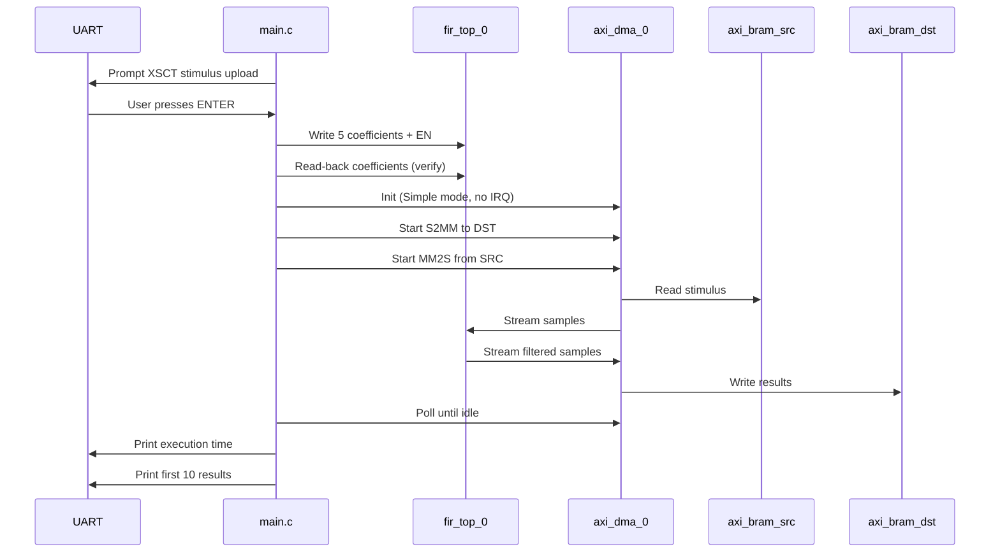

# 02 — Software

Bare-metal application for **Cortex-A53** (no Linux). Sources are in `software/src/`.

---

## Files

| File | Purpose |
|------|---------|
| `main.c` | Main application — FIR setup, DMA transfer, timing, results |
| `hw_config.h` | Peripheral base addresses / transfer length (maps to `xparameters.h`) |

---

## Application flow



---

## Key design choices

### No PS DDR for datapath

Stimulus and results live in **PL BRAM**. The application does **not** call `Xil_DCacheFlushRange` / `Invalidate` — there is no cache coherency issue for this path.

### Stimulus via XSCT (not in C)

`WaitForStimulusUpload()` prints instructions and blocks on UART until **Enter**. Students load `stimulus/src_stimulus.coe` with `load_stimulus.tcl` while the CPU is waiting.

### DMA order: S2MM first, then MM2S

```c
XAxiDma_SimpleTransfer(..., DEST_BRAM, ..., XAXIDMA_DEVICE_TO_DMA);  // S2MM
XAxiDma_SimpleTransfer(..., SRC_BRAM,  ..., XAXIDMA_DMA_TO_DEVICE);  // MM2S
```

S2MM must be armed before the FIR produces output; MM2S feeds the input stream.

### Transfer size

```c
#define TRANSFER_LEN_BYTES  1024U   /* 256 samples × 4 bytes/word */
```

Matches `stimulus/src_stimulus.coe` (256 words, values `0x1` … `0x100`).

### Accelerator timing

Uses the ARM global timer (`XTime_GetTime` / `xtime_l.h`):

- **Execution time** = from DMA kickoff until **both** MM2S and S2MM complete
- Also prints per-channel done times and sample throughput

---

## `hw_config.h` and BSP

After importing the XSA, Vitis generates `xparameters.h` with names such as:

- `XPAR_AXI_DMA_0_DEVICE_ID`
- `XPAR_AXI_BRAM_SRC_BASEADDR` or `XPAR_BRAM_1_BASEADDR`
- `XPAR_AXI_BRAM_DST_BASEADDR` or `XPAR_BRAM_0_BASEADDR`
- `XPAR_FIR_TOP_0_BASEADDR`

`hw_config.h` selects the correct macro when present, with fallbacks matching the XSA.

---

## Create the Vitis project

1. **File → New → Platform Project** (or update existing).
2. **Hardware specification:** `hardware/platform/fir_demo_wrapper.xsa`
3. Build the platform (FSBL / PMU optional for this lab).
4. **File → New → Application Project**
   - Platform: your `fir_demo` platform
   - Domain: `psu_cortexa53_0`
   - Template: **Empty Application** (or Hello World — then replace sources)
5. Copy `software/src/main.c` and `software/src/hw_config.h` into the app `src/` folder (replace the template main file if present).
6. **BSP settings** — ensure **axi_dma** driver is included (usually auto from XSA).
7. Build → `fir_demo.elf` (name may vary).

### Minimal link requirements

The app uses BSP drivers:

- `xaxidma` — DMA
- `xilprintf` / UART — console
- `xtime_l` — timer (standalone)

---

## Expected UART output (excerpt)

```
FIR DMA demo start
  FIR base 0xA0020000
  DMA dev id 0, len 1024 bytes

=== Stimulus upload required (XSCT) ===
...
Press ENTER in this UART window when upload is complete...
src BRAM[0] = 0x00000001
Starting FIR DMA demo...

FIR ctrl = 0x00000001 (EN=1)
coef[0] wrote 100, read 100
...
Accelerator timing (256 samples, 1024 bytes):
  MM2S done: ...
  S2MM done: ...
  Execution: ... us
result[0] = ...
FIR DMA demo done
```

---